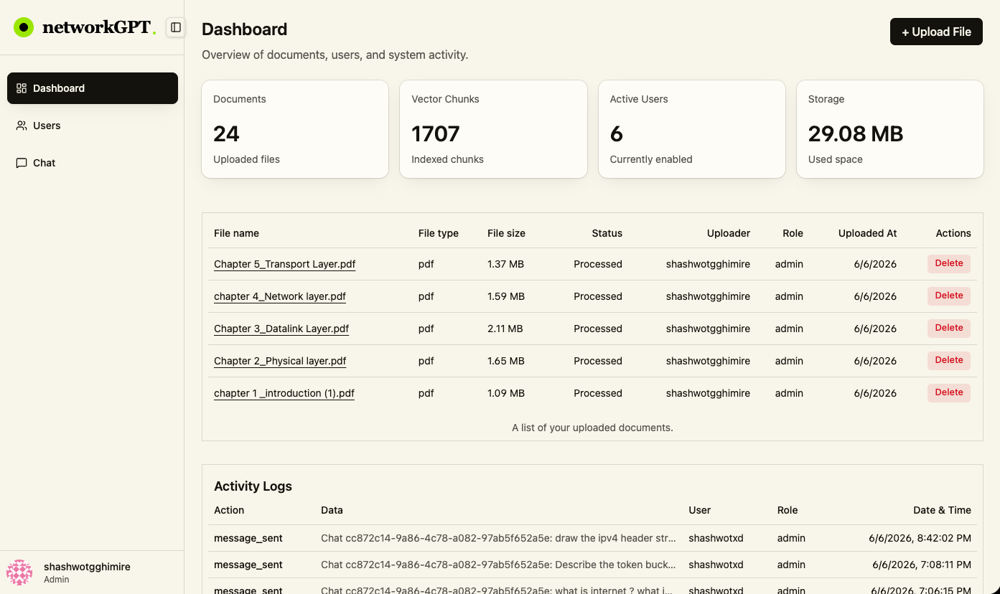
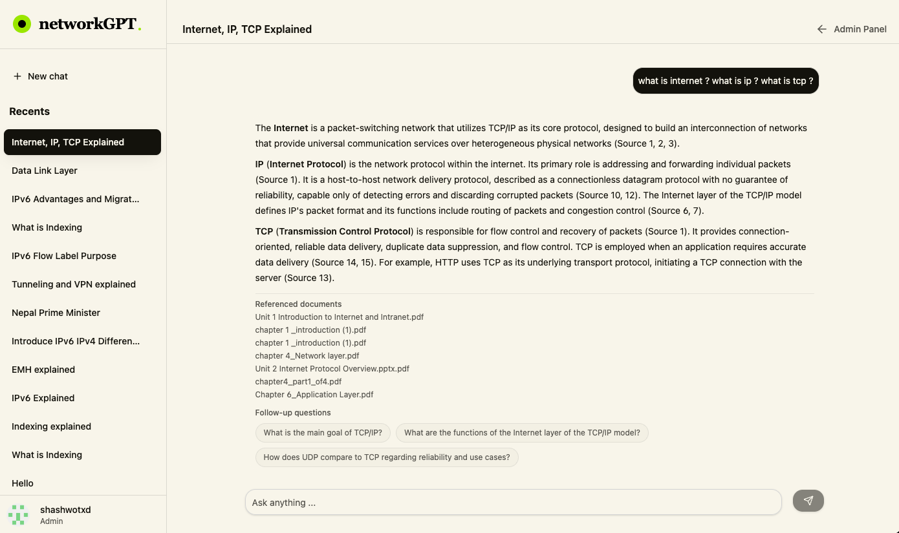
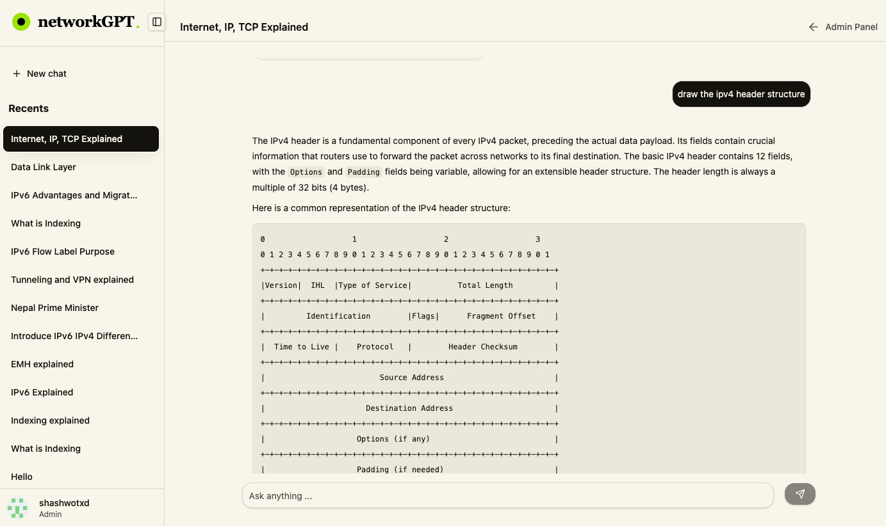

# Document Intelligence Platform

`networkGPT` is a full-stack, web-based AI chat platform for computer networks material. It lets users register, verify email, sign in, and ask questions against a shared knowledge base using Retrieval-Augmented Generation (RAG). Admin users manage the knowledge base and user access.

The project is implemented as two TypeScript applications:

- `api/`: Express backend for authentication, user/admin management, document ingestion, vector search, chat persistence, Server-Sent Events streaming, Swagger docs, and health checks.
- `web/`: React + Vite frontend for landing, registration, login, email verification, chat, profile management, and admin operations.

## Implemented Features

- Public landing page with product overview, screenshots, source/API links, and auth entry points.
- Email/password registration with duplicate-email protection.
- Email verification before login or protected API access.
- Secure login with JWTs that expire after 7 days.
- GitHub OAuth login/signup callback flow.
- First-user admin bootstrap.
- Role-based routing and API authorization for `admin` and `user`.
- Blocked-account enforcement in login, `/api/auth/me`, and protected middleware.
- Profile editing for display name and password changes.
- Gravatar avatar generation and account menu with sign out.
- Admin dashboard with total documents, chunks, users, and storage usage.
- Admin-only upload flow with file selection, preview, processing status, and error state.
- Supported knowledge-base file types: `.pdf`, `.docx`, `.txt`, `.csv`.
- S3 storage for original uploaded files and signed preview URLs in the admin table.
- Document deletion that removes both the S3 object and database chunks.
- Admin document table with file metadata, uploader data, status, signed file link, and delete confirmation.
- Admin users table with pagination, email status, role display, block, and unblock.
- Admin activity logs for document uploads, document deletion, and message sends.
- User chat workspace with sidebar, recent chats, create chat, rename chat, delete chat, and infinite chat loading.
- User-scoped chat and message access so users can only read their own chats/messages.
- Streaming AI answers over Server-Sent Events.
- Markdown rendering for assistant responses.
- Referenced document metadata shown under grounded AI messages.
- Three generated follow-up questions stored with each AI answer when useful.
- Automatic short chat title generation after the first user message.
- Swagger API documentation at `/api-docs` and raw OpenAPI JSON at `/api-docs.json`.
- Health endpoint at `/api/health`.
- Dockerfiles for API and web builds, plus a root `docker-compose.yml` for the API service.
- Vercel SPA rewrite config for the web app.

## Screenshots

### Admin Dashboard



### Network Chat



### Referenced Network Answer



## Technology Stack

| Frontend | Backend |
| --- | --- |
| TypeScript | TypeScript |
| React 19, Vite, React Router | Node.js, Express 5 |
| TanStack Query, Axios, `fetch` streaming | Sequelize ORM, PostgreSQL, `pgvector` |
| Tailwind CSS 4, shadcn/Radix-style components, Lucide icons | JWT, bcrypt, email verification,GitHub OAuth |
| React Markdown | Google Gemini via `@google/genai` |
| `localStorage` token persistence | Gemini embeddings, pgvector retrieval, Gemini streamed answers |
| Zustand installed, no active store currently used | AWS S3, Multer, `pdf-parse`, `mammoth`, `csv-parse` |
| Vercel deployment | Zod, Helmet, CORS allowlist, rate limiting, Swagger |

## Repository Structure

```text
.
|-- api/
|   |-- migrations/              # Sequelize migrations for users, docs, chunks, chats, messages, logs, OAuth-fields
|   |-- src/
|   |   |-- config/              # Swagger, frontend/backend origins, Sequelize CLI config
|   |   |-- controllers/         # Request handlers
|   |   |-- middlewares/         # Auth, roles, multer, validation, error handling, rate limits
|   |   |-- models/              # Sequelize models and associations
|   |   |-- routes/              # Express route definitions with Swagger annotations
|   |   |-- services/            # RAG, S3, parsing, chunking, embeddings, LLM, logging, Gravatar
|   |   |-- utils/               # API responses/errors, JWT, mail, prompts, parsers
|   |   |-- app.ts               # Express app wiring
|   |   |-- db.ts                # Sequelize and pgvector setup
|   |   `-- server.ts            # API entrypoint
|   |-- .env.sample              # API environment example
|   |-- Dockerfile
|   |-- package.json
|   `-- tsconfig.json
|-- web/
|   |-- public/                  # Static assets and screenshots
|   |-- src/
|   |   |-- components/          # Shared app and UI components
|   |   |-- hooks/               # Frontend hooks
|   |   |-- lib/                 # Utility functions
|   |   |-- pages/               # Route pages
|   |   |-- service/             # Axios client and API hooks
|   |   |-- App.tsx              # Frontend route definitions
|   |   |-- main.tsx             # React providers and app bootstrap
|   |   `-- index.css            # Tailwind/theme styles
|   |-- Dockerfile
|   |-- nginx.conf
|   |-- vercel.json
|   |-- package.json
|   `-- vite.config.ts
|-- docker-compose.yml
|-- PRODUCT.md
|-- CLAUDE.md
`-- README.md
```

## User Workflows

### First admin setup

1. Start PostgreSQL, the API, and the frontend.
2. Open `http://localhost:5173/register`.
3. Register the first account.
4. Verify the account using the emailed link.
5. Log in. The first account is routed as an admin.
6. Open `/admin/dashboard` to upload documents and manage the platform.

### Admin document upload

1. Admin opens `/admin/dashboard`.
2. Admin clicks `Upload File`.
3. Frontend opens a file picker and then a confirmation modal.
4. Admin can preview the selected file using `URL.createObjectURL`.
5. Frontend sends `multipart/form-data` to `POST /api/uploads`.
6. Backend stores the original file in S3.
7. Backend extracts text, chunks it, embeds each chunk, and stores metadata/chunks in PostgreSQL.
8. Backend marks the document as `Processed`.
9. Frontend refreshes dashboard stats, document table, and activity logs.

### User chat

1. User opens `/chat`.
2. If no `chatId` exists, frontend creates a chat and redirects to `/chat/:chatId`.
3. User sends a question from the chat input.
4. Frontend posts the message through `fetch()` to support streaming.
5. Backend saves the user message.
6. Backend embeds the query and retrieves nearest document chunks.
7. Backend streams Gemini output as Server-Sent Events.
8. Frontend renders markdown chunks as they arrive.
9. Backend stores the final AI message, referenced documents, and follow-up questions.
10. Frontend refreshes persisted message history and chat title/sidebar data.

### Admin user management

1. Admin opens `/admin/users`.
2. Frontend requests paginated users from `GET /api/auth/users`.
3. Admin can block or unblock each user.
4. Blocked users are rejected by login and by protected middleware.

### Profile and password update

1. User opens the account menu and selects `Edit profile`.
2. User can update display name.
3. Email/password users can update passwords by providing current password, new password, and confirmation.
4. Backend validates current password and hashes the new password.
5. GitHub-only users can update profile name but cannot change password in this app.

## RAG Implementation

The RAG pipeline is implemented in `api/src/controllers/uploads.controller.ts`, `api/src/controllers/messages.controller.ts`, and supporting services under `api/src/services/`.

### Ingestion pipeline

1. Admin uploads a file to `POST /api/uploads`.
2. Multer stores the file in memory and enforces:
   - Allowed extensions: `.pdf`, `.docx`, `.txt`, `.csv`
   - Maximum file size: 50 MB
3. Backend uploads the original file to S3 with a generated key under `uploads/`.
4. Backend extracts text by file type:
   - PDF: `pdf-parse`
   - DOCX: `mammoth.extractRawText`
   - TXT: UTF-8 buffer text
   - CSV: `csv-parse/sync` with headers, converted to readable `key: value` text rows
5. Backend splits extracted text with LangChain `RecursiveCharacterTextSplitter`:
   - `chunkSize: 500`
   - `chunkOverlap: 200`
6. Backend embeds every chunk with Gemini `gemini-embedding-001`.
7. Backend stores:
   - Document metadata in `documents`
   - Chunk text and `vector(3072)` embeddings in `document_chunks`
8. Backend commits the document and chunks in a Sequelize transaction.
9. Backend records a `file_uploaded` log event.
10. If processing fails after S3 upload, backend attempts to delete the uploaded S3 object.

### Retrieval and answer pipeline

1. User posts a message to `POST /api/messages/:chatId`.
2. Backend verifies the chat belongs to the current user.
3. Backend saves the user message in `chat_messages`.
4. Backend embeds the user query with `gemini-embedding-001`.
5. Backend performs pgvector nearest-neighbor search across indexed chunks:

   ```sql
   SELECT
     d."id" AS "documentId",
     d."filename" AS "documentName",
     d."file_type" AS "documentType",
     dc."id" AS "chunkId",
     dc."chunk_text" AS "chunkText",
     dc."chunk_index" AS "chunkIndex",
     dc."vector_embedding" <-> :embedding::vector AS distance
   FROM document_chunks dc
   JOIN documents d ON d.id = dc."document_id"
   ORDER BY dc."vector_embedding" <-> :embedding::vector
   LIMIT 15
   ```

6. Backend builds a context block from the retrieved chunks.
7. Backend sends a strict grounding prompt to Gemini `gemini-2.5-flash`.
8. Backend streams each text chunk to the browser as SSE:

   ```text
   data: {"chunk":"..."}

   data: {"metadataLoading":true}

   data: {"done":true}
   ```

9. Backend stores the completed AI response.
10. If the answer is not the fallback message, backend stores referenced document metadata from the retrieved chunks.
11. Backend generates exactly three follow-up questions when useful and stores them on the AI message.
12. For the first message in a chat, backend generates a short chat title of up to 6 words.
13. Backend increments the chat message count and writes a `message_sent` log.

### Grounding behavior

The prompt instructs the model to:

- Use only retrieved context.
- Avoid outside knowledge.
- State what is missing if context is partial.
- Return exactly `I don't have enough information to answer that.` when retrieved context is irrelevant.
- Use markdown because responses are rendered by `react-markdown`.

## Database Schema

Migrations live in `api/migrations/` and use `sequelize-cli`.

The initial migration enables:

- `pgcrypto` for `gen_random_uuid()`
- `vector` for pgvector embeddings

### `users`

| Column | Type | Notes |
| --- | --- | --- |
| `id` | UUID | Primary key, generated by PostgreSQL |
| `name` | string | Required |
| `email` | string | Required, unique |
| `password` | string, nullable | Bcrypt hash for email/password users; null for GitHub-only users |
| `gravatar_url` | string, nullable | Gravatar URL or GitHub avatar URL |
| `role` | enum `user`, `admin` | Defaults to `user`; first registered user becomes `admin` |
| `is_blocked` | boolean | Defaults to `false` |
| `is_email_verified` | boolean | Defaults to `false`; GitHub users are marked verified |
| `email_verification_token` | string, nullable | Cleared after successful email verification |
| `github_id` | string, nullable | Added by GitHub OAuth migration |
| `created_at`, `updated_at` | timestamp | Sequelize timestamps |

### `documents`

| Column | Type | Notes |
| --- | --- | --- |
| `id` | UUID | Primary key |
| `filename` | string | Original uploaded filename |
| `file_type` | enum `pdf`, `docx`, `txt`, `csv` | Supported source type |
| `file_path` | string | S3 object key |
| `file_size` | integer | Uploaded size in bytes |
| `file_processing_status` | enum `Processing`, `Processed`, `Failed` | Current processing state |
| `uploaded_by` | UUID | FK to `users.id` |
| `created_at`, `updated_at` | timestamp | Sequelize timestamps |

### `document_chunks`

| Column | Type | Notes |
| --- | --- | --- |
| `id` | UUID | Primary key |
| `document_id` | UUID | FK to `documents.id`, cascade delete |
| `chunk_text` | text | Extracted document segment |
| `chunk_index` | integer | Original chunk order within the document |
| `vector_embedding` | `vector(3072)` | Gemini embedding for pgvector search |
| `created_at`, `updated_at` | timestamp | Sequelize timestamps |

### `chats`

| Column | Type | Notes |
| --- | --- | --- |
| `id` | UUID | Primary key |
| `title` | string | Defaults to `New chat`; generated after first message or user-renamed |
| `user_id` | UUID | FK to `users.id`, cascade delete |
| `count` | integer | Number of user messages sent in the chat |
| `created_at`, `updated_at` | timestamp | Sequelize timestamps |

### `chat_messages`

| Column | Type | Notes |
| --- | --- | --- |
| `id` | UUID | Primary key |
| `chat_id` | UUID | FK to `chats.id`, cascade delete |
| `content` | text | User or AI message content |
| `message_role` | enum `user`, `ai` | Message author |
| `referenced_documents` | JSONB, nullable | Documents used for grounded AI answer |
| `follow_up_questions` | JSONB, nullable | Generated suggested next questions |
| `created_at`, `updated_at` | timestamp | Sequelize timestamps |

### `logs`

| Column | Type | Notes |
| --- | --- | --- |
| `id` | UUID | Primary key |
| `user_id` | UUID | FK to `users.id`, cascade delete |
| `action` | string | Event name such as `file_uploaded`, `file_deleted`, `message_sent` |
| `data` | text | Human-readable event data |
| `created_at`, `updated_at` | timestamp | Sequelize timestamps |

Associations:

- `User hasMany Document`
- `User hasMany Chat`
- `User hasMany Logs`
- `Document belongsTo User as uploader`
- `Document hasMany DocumentChunk`
- `Chat belongsTo User`
- `Chat hasMany Messages`
- `Messages belongsTo Chat`
- `Logs belongsTo User as user`

## API Documentation

Swagger UI is served by the API:

- Production: `https://shashwotghimire.tech/api-docs`
- UI: `http://localhost:8080/api-docs`
- OpenAPI JSON: `http://localhost:8080/api-docs.json`

All endpoint request/response details are documented in Swagger. Application routes are mounted under `/api`.

## Prerequisites

- Node.js 20+
- npm
- PostgreSQL with permission to create the `pgcrypto` and `vector` extensions
- AWS S3 bucket and access credentials
- Google Gemini API key(s)
- SMTP credentials for email verification
- GitHub OAuth app credentials

## Local Setup

### 1. Install dependencies

```bash
cd document-intelligence-platform

cd api
npm install

cd ../web
npm install
```

### 2. Configure the API

Create `api/.env` from the sample:

```bash
cd ../api
cp .env.sample .env
```

Fill in:

```env
PORT=8080
PGHOST=localhost
PGDATABASE=networkgpt
PGUSER=postgres
PGPASSWORD=your_database_password
PGSSLMODE=disable
PGCHANNELBINDING=

JWT_SECRET=replace-with-a-long-random-secret

FRONTEND_ORIGIN=http://localhost:5173

EMAIL_USER=your-from-address@example.com
EMAIL_PASS=your-resend-smtp-password

GEMINI_API_KEY=your-gemini-embedding-key
GEMINI_API_KEY_PROMPT=your-gemini-generation-key

AWS_REGION=your-aws-region
AWS_ACCESS_KEY_ID=your-aws-access-key-id
AWS_ACCESS_KEY_SECRET=your-aws-secret-access-key
AWS_S3_BUCKET=your-s3-bucket

GITHUB_CLIENT_ID=your-github-client-id
GITHUB_CLIENT_SECRET=your-github-client-secret
```

Notes:

- Use `PGSSLMODE=require` if your PostgreSQL provider requires SSL.
- `GEMINI_API_KEY` is used by the embedding service.
- `GEMINI_API_KEY_PROMPT` is used by the answer, follow-up question, and chat title generation service.
- `FRONTEND_ORIGIN` is used for verification email links and OAuth redirects.
- CORS allows `http://localhost:5173`, `https://documentgpt.shashwotghimire.com.np`, `https://www.documentgpt.shashwotghimire.com.np`, and any configured `FRONTEND_ORIGIN`.
- Email is configured for Resend SMTP in `api/src/utils/sendMail.ts` with host `smtp.resend.com`, user `resend`, port `2587`, and `secure: false`.
- For local GitHub OAuth, update `api/src/config/backend.ts` to your local backend origin.

### 3. Configure the web app

Create `web/.env`:

```bash
cd ../web
touch .env
```

Add:

```env
VITE_API_BASE_URL=http://localhost:8080/api
```

### 4. Prepare PostgreSQL

Create a local PostgreSQL database matching `PGDATABASE`. Then run migrations from `api/`:

```bash
cd ../api
npx sequelize-cli db:migrate --config src/config/config.js --migrations-path migrations
```

### 5. Start the API

```bash
npm run dev
```

The API listens on `http://localhost:8080` by default.

### 6. Start the frontend

Open a second terminal:

```bash
cd web
npm run dev
```

The Vite dev server runs at `http://localhost:5173` by default.

### 7. Create the admin account

1. Open `http://localhost:5173/register`.
2. Register the first user.
3. Verify the account from the email link.
4. Log in.
5. You should land in the admin experience.

## Migration Commands

Run these from `api/`:

```bash
# Check status
npx sequelize-cli db:migrate:status --config src/config/config.js --migrations-path migrations

# Apply pending migrations
npx sequelize-cli db:migrate --config src/config/config.js --migrations-path migrations

# Roll back the latest migration
npx sequelize-cli db:migrate:undo --config src/config/config.js --migrations-path migrations

# Roll back all migrations
npx sequelize-cli db:migrate:undo:all --config src/config/config.js --migrations-path migrations

# Generate a migration
npx sequelize-cli migration:generate --name your-migration-name --migrations-path migrations
```

## Useful Scripts

### API

```bash
cd api
npm run dev      # Start TypeScript dev server with tsx watch
npm run build    # Compile TypeScript to dist/
npm run start    # Run dist/server.js
npm test         # Placeholder; no automated tests are implemented
```

### Web

```bash
cd web
npm run dev      # Start Vite dev server
npm run build    # TypeScript build plus Vite production build
npm run lint     # Run ESLint
npm run preview  # Preview production build
```

## Deployment Notes

### Production URLs

- Frontend: deployed on Vercel at `https://documentgpt.shashwotghimire.com.np`
- API: hosted on a DigitalOcean Linux VPS at `https://shashwotghimire.tech`
- Swagger API docs: `https://shashwotghimire.tech/api-docs`

### Docker

The API and web app each include a Dockerfile.

`api/Dockerfile` builds TypeScript in a Node 20 Alpine builder image, installs production dependencies in the final image, exposes port `8080`, and runs:

```bash
node dist/server.js
```

`web/Dockerfile` builds the Vite app with `VITE_API_BASE_URL` as a build arg, copies `dist/` into Nginx, and serves on port `80`.

Example web image build:

```bash
cd web
docker build --build-arg VITE_API_BASE_URL=https://your-api.example.com/api -t networkgpt-web .
```

The root `docker-compose.yml` currently defines the API service only:

```bash
docker compose up --build api
```

The web service is present but commented out. Uncomment and set the `VITE_API_BASE_URL` build arg if you want to run both through compose.

### API Deployment

API deployment is automated with GitHub Actions in `.github/workflows/deploy.yml`.

The workflow runs on every push to `main`:

1. Checks out the repository.
2. Logs in to GitHub Container Registry.
3. Builds the API Docker image from `./api`.
4. Pushes the image to GHCR as:
   - `ghcr.io/<repository_owner>/documentgpt:latest`
   - `ghcr.io/<repository_owner>/documentgpt:<commit_sha>`
5. Connects to the DigitalOcean VPS over SSH using repository secrets.
6. Pulls the latest API image.
7. Stops and removes the existing `documentgpt-api` container if it exists.
8. Starts a new `documentgpt-api` container with:
   - `--restart always`
   - host port `8080` mapped to container port `8080`
   - environment variables loaded from the VPS `.env` file

Required GitHub repository secrets:

- `VPS_HOST`
- `VPS_USER`
- `VPS_SSH_KEY`

### Vercel

The frontend is deployed on Vercel. `web/vercel.json` rewrites all paths to `/`, which supports React Router browser routes on Vercel:

```json
{
  "rewrites": [{ "source": "/(.*)", "destination": "/" }]
}
```

Set `VITE_API_BASE_URL=https://shashwotghimire.tech/api` in the Vercel project environment.
